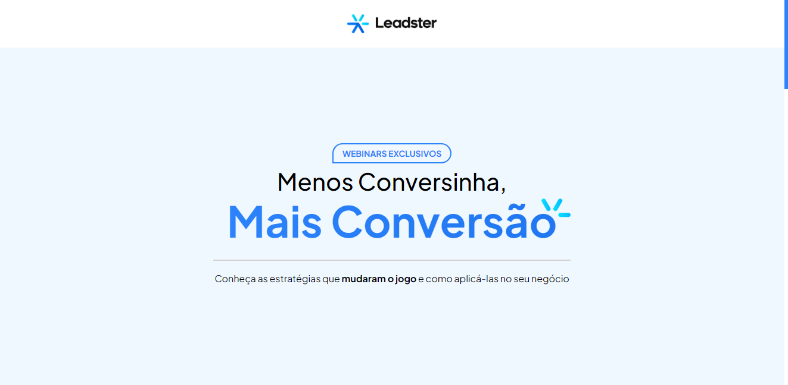

<h1 align="center">
  💻<br /><a href="https://.vercel.app">Teste Leadster</a>
</h1>



<h4 align="center"><a href="https://.vercel.app">Clique para visitar o projeto</a></h4>

## 🧠 Decisões:

Decidi criar o projeto usando a versão mais recente do Next com a app router já que está é melhor forma atualmente de criar rotas (na minha visão) garantindo que se o projeto 
aumentar isso não seja um problema, devido a isso torna-se necessário o marcador 'use client' na página principal devido a imcopatibilidade do Styled Components com o 
server side rendering do next.

Utilizei a biblioteca framer motion para criar animações de scroll e inicialização e a biblioteca React Icons para os icones do projeto.

## 📚 Organização: 

Organizei meu código a partir da componentização, separando componentes utilitários como: botões, selects, linhas e vários outros, e sessões como: Apresentação e 
Demonstração do site separadas em uma pasta com o nome de sections.

Além disso criei componentes padrão para diversos casos como containers, imagens e wrappers para deixar o desenvolvimento mais padronizado e eficiente, assim ao criar
componentes desse tipo precisa apenas herda-los e aplicar os demais estilos ou em casos mais simples utiliza-los diretamente para a construção da interface.

## 🔥 Funcionalidades e intruções:

O projeto conta com funcionalidades extras como as animações de scroll e hover em diversos elementos.

Também foi utilizado a biblioteca storybook para documentação dos componentes.

### 🚀 Como rodar o projeto?

para rodar o projeto você precisa ter o Node e o Git instalado em sua máquina caso não tenha o Node instale-o <a href="https://nodejs.org/en">aqui</a>

abra seu terminal e utilize o comando:
```
git clone https://github.com/EnzoSylvestrin/leadster-test.git
```

após o termino da instalação navegue até o diretório como o comando:
```
cd leadster-test
```

instale as dependencias do projeto com o comando:
```
npm i --save
```

e por fim execute o projeto utilizando o comando:
```
npm run dev
```

então é só abrir o endereço http://localhost:3000 e visualizar o projeto! 

para ver o projeto na vercel clique <a href="https://.vercel.app">aqui</a>


